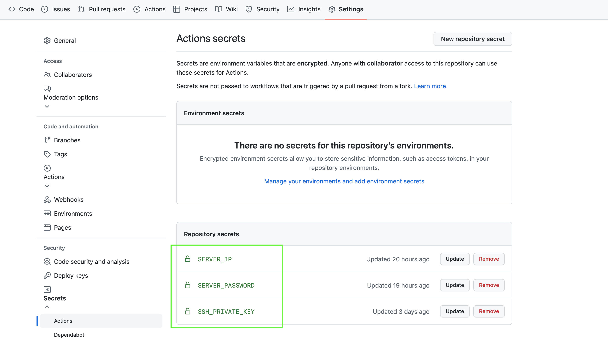

## Github Actions

Github Actions 是 Github 提供的 CI/CD 服務，講白話一點就是將程式流程自動化，例如在 push 到 repo 後自動 build、自動跑測試、自動部署等等。

一般實作 CI/CD 的方式通常就是撰寫 config 檔 （例如 yml、json），再由 CI/CD 的服務依照 config 來執行對應的操作。

## Github Actions 基本元素

由大到小：
```
Workflow -> Job -> Step -> Action
```
* Workflow : CI/CD 一次要運行的整個過程(內有多個Job、Step、 Action)。
* Job : 代表「任務」，一個 Workflow 可以完成多個任務。
* Step : 一個 Job 是由多個步驟來完成。
* Action : 「命令」，每個 Step 可以依序執行多個命令。
  
## Github Actions 啟用 

(Workflow document 採用 YAML 格式)
將專案推到 Github 上後 Github 就會自動執行放在該路徑裡的 .yml config 檔

1. 專案的根目錄新增config檔 : .github/workflow/xxxx.yml
2. Git 專案底下的 Actions 分頁直接自動生成：
   

## Workflow Config

[config 語法官方文件](https://docs.github.com/en/actions/using-workflows/workflow-syntax-for-github-actions)

```
name: [workflow name]   (workflow 取名，可省略)
on:
  push:
    - master
  pull_request: 
    - master

  schedule: (註1)
    - cron: "30 5 * * 1,3"  (星期一~星期三 的 UTC 5:30 自動執行)

jobs:
  job-name1:  (jobs名稱)
    runs-on: ubuntu-latest  (運行所需的虛擬機環境，必填)
    steps:
      - name: Checkout
        uses: actions/checkout@v2  (讓使用者在 workflow 中使用 github 上的專案原始碼)
        (註2)

      - name: Install
        run: npm install

      - name: Build
        run: npm run build

      - name: Deploy file to server
        uses: ilCollez/ssh-scp-deploy@main  (註3)
        with:
          host: ${{ secrets.SSH_HOST }}  (註4)
          port: ${{ secrets.SSH_PORT }}
          username: ${{ secrets.SSH_USER }}
          key: ${{ secrets.SSH_KEY }}
          files: './dist/*'  (本地路徑)
          remote-path: '/xxxx/xxxxx/xxxx'  (遠端路徑)
```
  註1：[cron 時間設定](https://crontab.guru)  
  註2：[Github Marketplace (用於steps下的users)](https://github.com/marketplace?type=actions&query=git+checkout+)  
  註3：[ilCollez/ssh-scp-deploy@main 其他參數設定](https://github.com/ilCollez/ssh-scp-deploy)  
  註4：為了安全，不將 SSH key 、host等等資訊寫在actions中，可在 settings/secrets 裡添加信息後，在 actions中引用。
